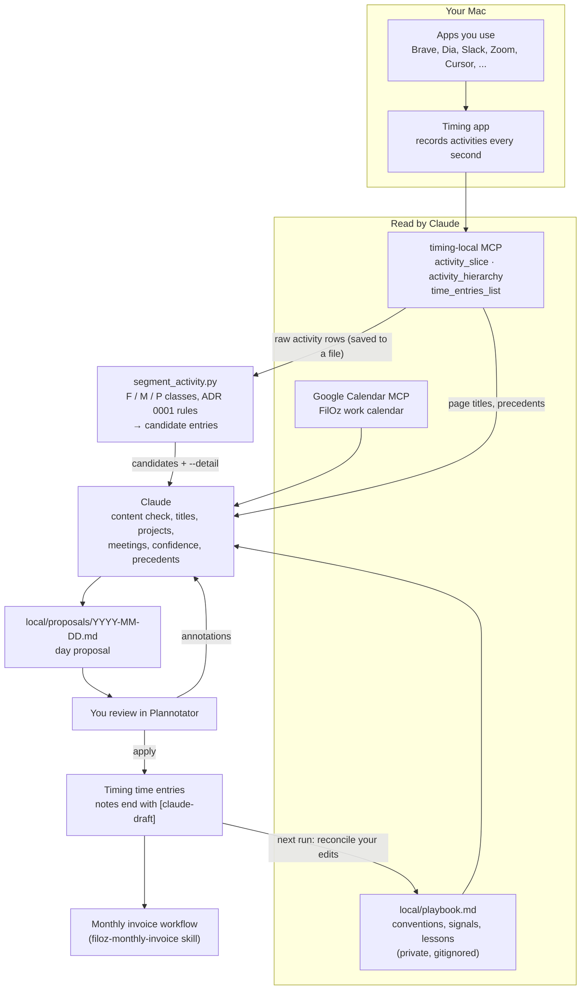
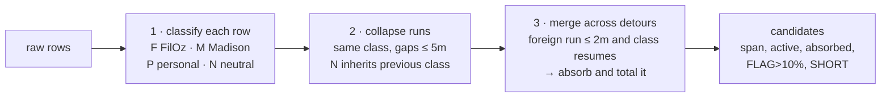

# How the daily draft works

A human-friendly walkthrough of the `timing-daily-draft` skill: what data comes out of Timing, what Claude does with it, where the segmenter fits, and how past entries are used to make better calls. For the rules themselves, see [ADR 0001](adr/0001-billing-integrity-two-minute-detours.md) (billing integrity) and [ADR 0004](adr/0004-mechanical-segmentation-with-accuracy-gates.md) (segmentation and accuracy gates). Vocabulary is in [CONTEXT.md](../CONTEXT.md).

All sample data below is synthetic, modeled on the real formats. People, emails, and private titles are replaced.

## The big picture



In one sentence: Timing records everything, the segmenter cuts the day into candidate blocks mechanically, Claude decides what each block *is* using the playbook and past entries, you review, and only then does anything get written.

## Two kinds of Timing data

Timing keeps two separate things, and they're easy to confuse:

| | Activities | Time entries |
|---|---|---|
| Created by | Timing, automatically | You (or Claude on apply) |
| Granularity | Seconds; one row per app/window change | Minutes to hours; one block per thread of work |
| Has a project? | Only via Timing's auto-categorization rules (often wrong or missing) | Yes, deliberately chosen |
| Billed? | Never directly | Yes, if under the FilOz tree and `billable` |
| MCP tools | `activity_slice`, `activity_hierarchy` | `time_entries_list`, `time_entry_create` |

The whole skill is a translation from the left column to the right column.

## What the MCP returns

### `activity_slice`: raw rows, second by second

This is the main input. One call covers the whole day (`includePaths: false`, high `limit`). A real day is about 1,900 rows and 230 KB, too big to show inline, so Claude Code saves it to a file and the segmenter reads that file. A 75-minute excerpt ([docs/samples/activity-slice-sample.txt](samples/activity-slice-sample.txt)):

```text
Time range: 2026-09-14T08:50 – 2026-09-14T10:05
Total duration: 1h 6m (3960 seconds)
Activities: 20

08:50:00-08:56:00 | 6m  | Dia              | docs.google.com              | Volunteering ▸ Madison Ultimate
08:56:10-08:59:50 | 4m  | Brave Browser    | docs.google.com              | FilOz
08:59:54-09:05:19 | 5m  | Zoom             | Zoom Meeting                 | (Unassigned)
09:05:19-09:06:30 | 1m  | Messages         | (no title)                   | Life Admin ▸ Communicating
09:06:30-09:27:05 | 21m | Zoom             | Zoom Meeting                 | (Unassigned)
...
09:36:25-09:41:47 | 5m  | Safari           | www.imdb.com                 | (Unassigned)
...
10:01:00-10:03:00 | 2m  | Brave Browser    | localhost                    | Volunteering ▸ Madison Ultimate
10:03:00-10:04:00 | 1m  | Cursor           | MadisonUltimate (Workspace)  | FilOz ▸ Admin
```

Columns: time span, duration, app, **context** (browser domain, else file path, else window title), and the project Timing's rules assigned. Two things to notice:

- **Browsers show only the domain.** `docs.google.com` could be a FilOz doc or a Madison doc. Page titles need a second call (below).
- **The project column is a hint, not truth.** Above, a Madison Cursor workspace is tagged `FilOz ▸ Admin` (an old rule matched "Admin" in `CoachAdmin`), and Madison Gmail in Dia was tagged `FilOz ▸ Communication` before that rule was fixed.

### `activity_hierarchy`: page titles, grouped

When a block's domain isn't enough to name it, Claude asks for the titles in just that block's time range. Output is a tree: app → domain → page title → path.

```text
=== 09:00-09:15 ===
12m Brave Browser
	9m docs.google.com
		5m Notes - FilOz Staff Meeting - Google Docs - <work profile>
		4m Engineering and Customer Experience Sync - Google Docs - <work profile>
	2m github.com
		<1m Upgrade Pattern · Issue #5 · filecoin-project/solstice - <work profile>
1m Zoom
	1m Zoom Meeting
1m Slack | Filecoin
	1m filoz-staff (Channel)
```

This is where most of the "what was I actually doing" signal lives: repo and issue names, doc titles, Slack channels, WhatsApp group names, the Madison vs FilOz browser profile in the title.

### `time_entries_list`: your entries

Used three ways: to see what already exists on the day (never overlapped), to reconcile what you changed after an apply, and to look up precedents.

```text
time_XXXXXXXXXXX | 2026-09-11 08:39-08:56 | 17m | title=Ad-hoc 1 on 1 | project=FilOz ▸ 1 on 1 | billing=billable | via=mac-mcp
	notes: Zoom in personal meeting room, no calendar event or Granola notes; attendee unknown. Includes 3.3m of email read while the call was open. [claude-draft]
```

`via=mac-mcp` and `[claude-draft]` mark entries Claude created, so reconciliation can tell them apart from yours.

### Google Calendar: meetings

The FilOz work calendar gives the scheduled meetings, attendees, and who declined. Calendar is only a hint: the entry uses the span you actually attended, taken from Zoom/Meet/Granola activity. In the sample above, a staff meeting scheduled 09:00 to 09:40 shows Zoom from 08:59:54, with prep in the meeting notes doc from 08:56.

## Where the segmenter fits

`filoz_time_tracking/segment_activity.py` does the mechanical part, so the boundaries are reproducible instead of eyeballed. It does no guessing about topics, titles, or subprojects.



1. **Classify** each row by app: Brave, Slack, Zoom, Orca are F; Dia is M; Safari, Messages, Mail are P; Claude, ChatGPT, Finder, Xcode are neutral (they inherit whatever came before). Two exceptions look past the app. Cursor is classified by workspace name. A Brave row on `localhost` that Timing filed under Madison is M: that's Plannotator reviewing a Madison repo in the FilOz Brave profile. Timing sees the full page title (`<madison repo> · Plannotator`) and its rule gets the project right, while the raw row only shows the domain, so the segmenter trusts Timing's project here and nowhere else in Brave.

WhatsApp is M. A WhatsApp row carries no chat name (the context is `(no title)`), so the segmenter can't tell a Madison group from any other chat, and in practice WhatsApp is the Madison coach groups. **If you ever use WhatsApp for something else** (family, friends), run with `--whatsapp-personal` for that day, or those chats will be folded into Madison entries. That costs nothing on the invoice, since Madison is never billed, but the Madison entries would be wrong. The chat names are visible through `activity_hierarchy` with `appName: "WhatsApp"` if you need to check.
2. **Collapse** consecutive rows of the same class into blocks, bridging silence of 5 minutes or less.
3. **Merge** across short detours: if a foreign stretch totals 2 minutes or less and the original class resumes, it's absorbed and its time is recorded. Longer detours or longer silences end the candidate.

Running it on the sample with `--detail`:

```text
M 08:50:00-08:56:00 span=  6.0m active=  6.0m
      6.0m M Dia | docs.google.com | Volunteering ▸ Madison Ultimate
F 08:56:10-09:36:25 span= 40.2m active= 39.0m absorbed[P:1.2m]
     32.1m F Zoom | Zoom Meeting | (Unassigned)
      5.4m F Brave Browser | docs.google.com | FilOz
      1.2m P Messages | (no title) | Life Admin ▸ Communicating
      1.1m F Brave Browser | github.com | FilOz ▸ Filecoin Onchain Cloud
      0.3m N Timing Tracker | (no title) | (Unassigned)
P 09:36:25-09:42:30 span=  6.1m active=  6.1m
      5.4m P Safari | www.imdb.com | (Unassigned)
      0.7m P Messages | (no title) | Life Admin ▸ Communicating
F 09:49:00-09:51:06 span=  2.1m active=  2.1m SHORT
      2.1m F Brave Browser | github.com | FilOz ▸ Filecoin Onchain Cloud
M 09:51:06-10:05:00 span= 13.9m active= 12.9m absorbed[F:1.0m]
      3.9m M Dia | mail.google.com | FilOz ▸ Communication
      3.8m M Dia | docs.google.com | (Unassigned)
      2.5m M Brave Browser | localhost | Volunteering ▸ Madison Ultimate
      1.2m M WhatsApp | (no title) | Life Admin ▸ Communicating
      1.0m F Slack | (no title) | FilOz ▸ Communication
      1.0m M Cursor | MadisonUltimate (Workspace) | FilOz ▸ Admin
      0.5m M Dia | app.notion.com | Volunteering ▸ Madison Ultimate
```

How to read it:

- **`span`** is start to end; **`active`** excludes bridged silence.
- **`absorbed[P:1.2m]`**: the 1.2 minutes of Messages inside the meeting were under the 2-minute limit, so the candidate continues, and that total goes in the entry's notes.
- **The 6-minute IMDb stretch** is over 2 minutes, so it ends the FilOz candidate at 09:36:25 and becomes a P block. Personal blocks never get entries.
- **`SHORT`** marks candidates under 5 minutes. They usually stay uncovered.
- **`FLAG>10%`** means absorbed time is over 10% of a FilOz candidate. The proposal must say what to do about it.
- **The last candidate is Madison, not FilOz.** Brave by app would say FilOz, but the rows are Brave `localhost` filed by Timing under Madison (Plannotator on a Madison repo), so they're M. The 1 minute of Slack in the middle is a FilOz glance under 2 minutes, so it's absorbed and reported.

## What Claude does with the candidates

The segmenter's output is a starting point. For each candidate, Claude:

1. **Content-checks it.** Reads the `--detail` lines, and for ambiguous domains (`github.com`, `docs.google.com`, `localhost`, untitled Slack) fetches page titles for just that time range. Checks Cursor/Orca repos by where they live on disk, WhatsApp group names, and Messages contacts against the playbook. Relabels anything the app-only classifier got wrong and says so in the proposal.
2. **Picks the subproject and title.** From the playbook's signals: `filecoin-project/solstice` issues mean Basecamp, the FOC board means Filecoin Onchain Cloud, the Eng & CX Sync doc means "Weekly meeting prep", and so on. Titles come from your own vocabulary in the playbook.
3. **Matches meetings.** Each calendar event is either entered with the attended span from Zoom/Meet activity, or listed under "Calendar events not entered" with the reason.
4. **Splits by thread where it matters.** A long FilOz candidate that moves from a PR review to meeting prep may become two entries.
5. **Sets confidence.** High when the signal is unambiguous; Med or Low when it rests on a default or a judgement, with the reasoning and what would change the call.
6. **Writes the day proposal** as one timeline: entries with evidence and flags inline, uncovered stretches between them in italics, and the FilOz total at the top.

## Learning from past categorization

Two feedback loops, one fast and one slow.

### Precedent lookups (during drafting)

When a call is Med or Low, Claude looks for how you handled something similar before. The searches are kept small on purpose, since whole-project listings with meeting boilerplate can be tens of kilobytes.

| Question | Tool and shape | Example |
|---|---|---|
| Has this title been used, and how much? | `time_entry_stats_total_time` with `searchQuery` | `searchQuery: "Weekly meeting prep"` over the last 3 months returns one total. A non-zero total confirms the title is in use. |
| Which project did a similar meeting go to? | `time_entries_list`, one project, short range, low `limit` | `projectIdentifiers: ["FilOz ▸ 1 on 1"]` to confirm a monthly check-in title was filed there before. |
| What did you call time spent on this signal? | `activity_hierarchy` with `regexFilter` and `includeTimeEntries: true` | `regexFilter: {pattern: "Plannotator", field: "title"}` over a past month shows which of your entries covered Plannotator activity, and their projects. |
| Which chats were in WhatsApp today? | `activity_hierarchy` with `appName: "WhatsApp"` | Only needed if WhatsApp might have been non-Madison that day; if so, run with `--whatsapp-personal`. |

The third shape is the most useful for learning, because it lines up raw activity with the entry that covered it. Its output looks like this (illustrative; figures are made up):

```text
2026-08-29
  Volunteering ▸ Madison Ultimate
    Webapp setup (10:13–10:53)
      Brave Browser | localhost
        12m <madison repo> · Plannotator - <work profile>
```

That precedent is why "Plannotator titled with a Madison repo means Madison" is a High-confidence signal in the playbook.

### Reconciliation (after you've reviewed)

At the start of each run, Claude compares the last applied proposal with what's now in Timing. Every difference (an entry deleted, moved, retitled, re-projected, or one you added) is shown to you as "mistake, or lesson?" Each lesson touches the playbook in two places, which do different jobs. The conventions and signals sections are the *current rule* (what to do now), and they get edited in place. The lessons log is an append-only *history* (what went wrong, on which day, and what changed), like a changelog next to code. The log is what gets re-read after a batch of days to spot repeated mistakes and fold them into better conventions. To keep the overlap small, a log row stays one line and names the change rather than restating the rule. Annotations you leave on a proposal before applying work the same way. For example, your Sep 14 notes became "FilOz Gmail time is billable, newsletters included" and "don't spend review questions on Madison granularity".

A mislabel that repeats gets fixed at the source: in the segmenter's app lists, in a Timing auto-categorization rule (dry run first), or in the playbook.

## Where things live

| What | Where | Committed? |
|---|---|---|
| Rules and their reasons | `docs/adr/` | Yes |
| Vocabulary | `CONTEXT.md` | Yes |
| The skill's procedure and gates | `.claude/skills/timing-daily-draft/SKILL.md` | Yes |
| Segmenter | `filoz_time_tracking/segment_activity.py` | Yes |
| This doc and its sample | `docs/timing-daily-draft.md`, `docs/samples/` | Yes (synthetic data only) |
| Conventions, signals, names, lessons | `local/playbook.md` | No (private, [ADR 0002](adr/0002-private-playbook-outside-git.md)) |
| Day proposals | `local/proposals/YYYY-MM-DD.md` | No |

## Known gaps

- **Classification is mostly by app.** Brave is FilOz except `localhost` rows Timing filed under Madison, WhatsApp is Madison, and everything else follows the app lists. Messages contacts and Orca still need the content check. Opening Plannotator somewhere other than Brave is possible (Plannotator's `PLANNOTATOR_BROWSER` accepts an app name or a script path, and `orca tab create --url` opens a URL in Orca), but deliberately not done: Timing records no window titles for Orca, so a Madison review there would be indistinguishable from FilOz work.
- **Some apps have no titles.** Orca, ChatGPT, and the Claude desktop app rows carry no context, so Orca defaults to FilOz and ChatGPT and Claude inherit their neighbor's class. Their content can't be checked. Timing's release notes say it tracks ChatGPT and Claude conversation titles (and once fixed ChatGPT names that had stopped being tracked), so blank titles here look like a regression or a permissions problem rather than a missing feature. Timing has no public issue tracker, so this would be a report to Timing support.
- **Off-computer time is invisible.** Phone calls and whiteboard time never show up and are never billed unless you add them.
